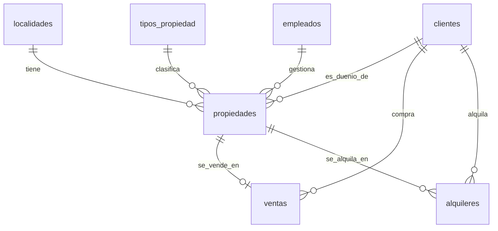

# 🏠 Inmobiliaria Grosman – Documentación Técnica

## 📌 Introducción
La base de datos **inmobiliaria_grosman** modela la operatoria de una inmobiliaria: administración de propiedades, normalización de tipos de propiedad y localidades, gestión de clientes (dueños, compradores, inquilinos), registro de ventas y contratos de alquiler. Incluye vistas, índices, triggers y stored procedures para optimizar consultas y automatizar reglas de negocio.

## 🎯 Objetivo
Diseñar un esquema relacional **coherente, normalizado y performante** que permita:
- Publicar y consultar propiedades (en venta / alquiler).
- Registrar transacciones (ventas, alquileres) con reglas de negocio.
- Garantizar integridad referencial y calidad de datos.
- Exponer vistas y SPs para aplicaciones o BI.

## ⚠️ Situación problemática
La inmobiliaria llevaba todos los procesos en papel: duplicación de datos, inconsistencias, tiempos lentos de búsqueda y sin trazabilidad. Con la BD se unifican criterios, se evitan errores, se automatizan estados mediante triggers y se habilitan reportes confiables.

## 💼 Modelo de negocio
- **Clientes**: dueños, inquilinos y compradores.
- **Empleados**: asesores asignados a propiedades.
- **Localidades** y **Tipos de Propiedad**: catálogos normalizados.
- **Propiedades**: entidad central; vinculada a un **cliente** (dueño), un **empleado**, una **localidad** y un **tipo**. Contiene flags `en_venta`, `en_alquiler` y estado derivado `vendida`.
- **Ventas**: una propiedad solo puede venderse una vez (constraint UNIQUE).
- **Alquileres**: triggers validan que no se alquilen propiedades vendidas ni se superpongan contratos.

## 📊 Diagrama E-R

> Nota: ver columnas y restricciones detalladas en las tablas.

## 🗂️ Listado de tablas y columnas
**PK** = clave primaria · **FK** = clave foránea · **UK** = clave única

### `localidades`
| Columna       | Tipo          | Clave | Descripción            |
|---------------|---------------|-------|------------------------|
| id_localidad  | INT AI        | PK    | Identificador único    |
| nombre        | VARCHAR(100)  |       | Nombre localidad       |
| provincia     | VARCHAR(100)  |       | Provincia              |
| codigo_postal | VARCHAR(10)   |       | Código postal          |

### `empleados`
| Columna     | Tipo          | Clave | Descripción        |
|-------------|---------------|-------|--------------------|
| id_empleado | INT AI        | PK    | ID del empleado    |
| nombre      | VARCHAR(100)  |       | Nombre             |
| apellido    | VARCHAR(100)  |       | Apellido           |
| email       | VARCHAR(100)  |       | Email              |
| telefono    | VARCHAR(20)   |       | Teléfono           |

### `clientes`
| Columna    | Tipo          | Clave        | Descripción        |
|------------|---------------|--------------|--------------------|
| id_cliente | INT AI        | PK           | ID cliente         |
| nombre     | VARCHAR(100)  |              | Nombre             |
| apellido   | VARCHAR(100)  |              | Apellido           |
| dni        | VARCHAR(20)   | UK, NOT NULL | Documento único    |
| email      | VARCHAR(100)  |              | Email              |
| telefono   | VARCHAR(20)   |              | Teléfono           |

### `tipos_propiedad`
| Columna           | Tipo        | Clave | Descripción           |
|-------------------|-------------|-------|-----------------------|
| id_tipo_propiedad | INT AI      | PK    | ID tipo de propiedad  |
| nombre            | VARCHAR(50) | UK    | Nombre oficial        |

### `propiedades`
| Columna          | Tipo             | Clave | Descripción                   |
|------------------|------------------|-------|-------------------------------|
| id_propiedad     | INT AI           | PK    | ID propiedad                  |
| direccion        | VARCHAR(255)     |       | Domicilio                     |
| id_localidad     | INT              | FK    | Localidad                     |
| id_tipo_propiedad| INT              | FK    | Tipo                          |
| ambientes        | SMALLINT UNSIGN  |       | Número de ambientes           |
| superficie       | INT UNSIGNED     |       | m² (>0)                       |
| precio           | DECIMAL(12,2)    |       | Precio listado                |
| en_alquiler      | TINYINT(1)       |       | Flag publicación alquiler     |
| en_venta         | TINYINT(1)       |       | Flag publicación venta        |
| vendida          | TINYINT(1)       |       | Estado derivado (triggers)    |
| id_empleado      | INT              | FK    | Asesor asignado               |
| id_cliente       | INT              | FK    | Propietario                   |
| precio_m2        | DECIMAL(10,2)    | GEN   | Calculado (precio/superficie) |

### `ventas`
| Columna      | Tipo          | Clave  | Descripción       |
|--------------|---------------|--------|-------------------|
| id_venta     | INT AI        | PK     | ID venta          |
| id_propiedad | INT           | FK, UK | Propiedad vendida |
| id_comprador | INT           | FK     | Cliente comprador |
| fecha_venta  | DATE          |        | Fecha             |
| precio_venta | DECIMAL(12,2) |        | Precio de venta   |

### `alquileres`
| Columna        | Tipo          | Clave | Descripción         |
|----------------|---------------|-------|---------------------|
| id_alquiler    | INT AI        | PK    | ID alquiler         |
| id_propiedad   | INT           | FK    | Propiedad alquilada |
| id_inquilino   | INT           | FK    | Cliente inquilino   |
| fecha_inicio   | DATE          |       | Inicio contrato     |
| fecha_fin      | DATE          |       | Fin contrato / NULL |
| precio_mensual | DECIMAL(10,2) |       | Canon mensual       |

## 💻 Scripts
- **DDL (creación de objetos)**: [`Entrega_final_ddl.sql`](Entrega_final_ddl.sql)
- **DML (inserción de datos)**:[`Entrega_final_dml.sql`] (Entrega_final_dml.sql)

## 🔧 Objetos avanzados
- **Triggers**: actualizan `vendida` y `en_venta`; evitan alquileres en propiedades vendidas y solapamientos.
- **Vista `vista_propiedades_master`**: consolidado de propiedades con propietario, asesor, localidad y tipo.
- **Stored Procedures**: búsqueda por localidad, listado de en venta, registro de ventas y alquileres con validaciones.

